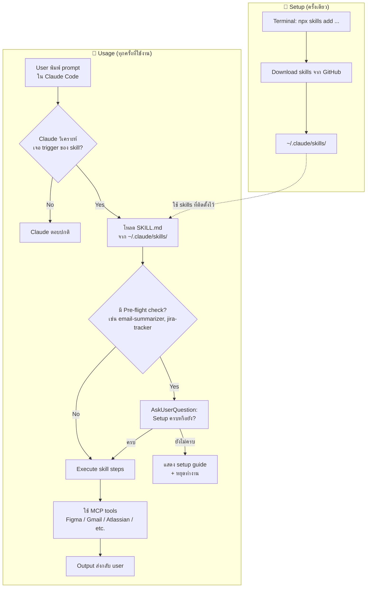

# UXUI library skill

Skills และคู่มือสำหรับทีม Designer ใช้ Claude Code ร่วมกับ Figma

## Workflow — Claude ใช้ Skill ยังไง



---

## ติดตั้ง

### วิธีที่ 1 — Claude Code Plugin (แนะนำ)

ใช้ได้ในทุก environment แม้ network บล็อก npm:

```
claude plugin marketplace add https://github.com/sittipons-ike/uxui-skill-library
claude plugin install uxui-skills
```

### วิธีที่ 2 — npx (ถ้า network เปิด npm)

```
npx skills add sittipons-ike/uxui-skill-library
```

> อยากดูคู่มือฉบับเต็ม (ลง Node.js, ต่อ Figma MCP, ฯลฯ) → อ่าน **[ONBOARDING.md](ONBOARDING.md)**

## Skills ที่มี

**พร้อมใช้ทันที**

| Skill | หน้าที่ |
|---|---|
| `setup-helper` | Guide ทีมตอน install ครั้งแรก — เช็ก prerequisites + แนะนำ skill แรก |
| `audit-ui` | ตรวจ Figma DS compliance ก่อน handoff |
| `ux-skill` | วาง User Flow + Information Architecture |
| `ui-skill` | Map component + design token จาก Blueprint |
| `ux-writing` | เขียน / rewrite microcopy บน UI |
| `masterprompt` | แปลง idea คร่าวๆ เป็น structured prompt |
| `notion-planning` | วางแผนงานลง Notion |
| `prd` | สร้าง Product Requirements Document |
| `audit` | ตรวจ interface quality ด้าน accessibility, performance, responsive |

**ต้อง setup ก่อนใช้** ⚠️

| Skill | ต้องการ |
|---|---|
| `email-summarizer` | Gmail MCP + (optional) Lark webhook |
| `jira-tracker` | Atlassian MCP + Lark webhook + config Jira project |

> skill ที่มี ⚠️ จะแสดง checklist setup ให้กรอกก่อนทุกครั้งที่รัน

**ตัวเสริม (ติดตั้งแยก)**

animate, polish, colorize, critique, audit, adapt, arrange, bolder, clarify, distill, delight, extract, frontend-design, harden, normalize, onboard, optimize, overdrive, quieter, teach-impeccable, typeset

ติดตั้งด้วย:
```
npx skills add pbakaus/impeccable
```

## อัปเดต Skills

**Plugin:**
```
claude plugin marketplace update
```

**npx:**
```
npx skills add sittipons-ike/uxui-skill-library
```
