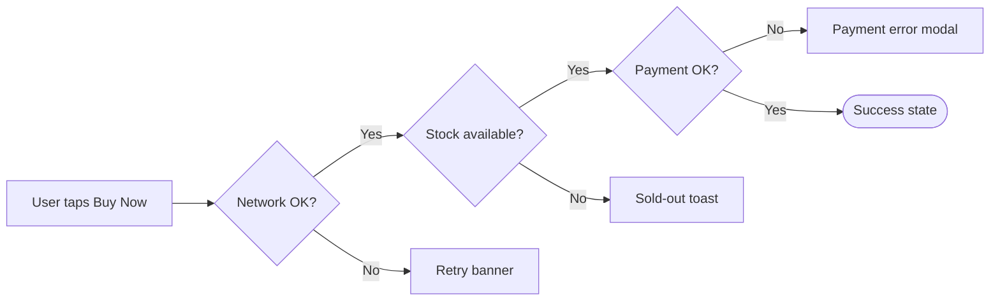
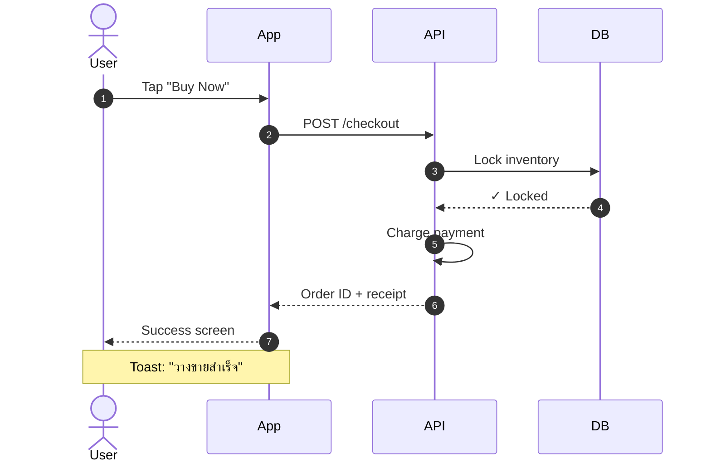
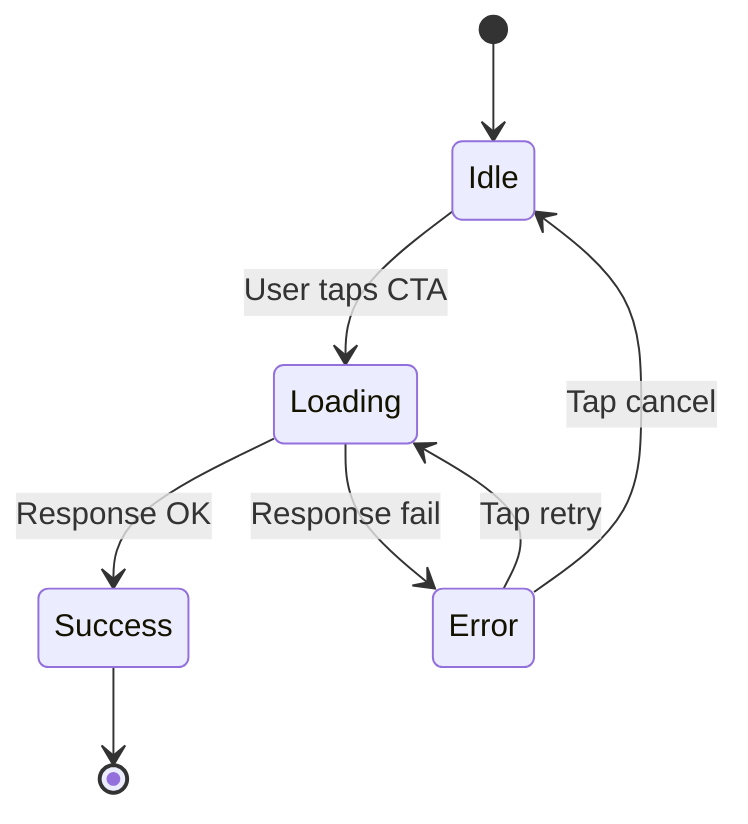
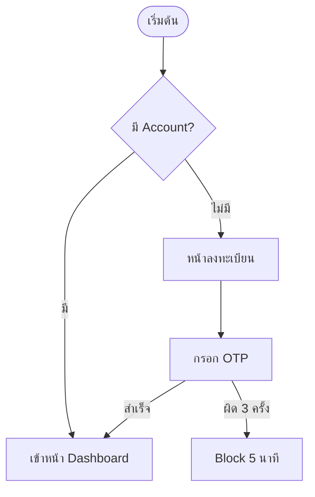

# Mermaid Render Test — UX Blueprint Sample

> ทดสอบว่า GitHub render Mermaid block ได้ไหม + ใช้ Thai text ได้ไหม
> ถ้าเห็น diagram = OK, ถ้าเห็น code block plain = ไม่ render

---

## 1. User Flow — Checkout One-Tap (ตัวอย่าง)

```mermaid
flowchart TD
    Start([เปิดหน้า Product])
    Cart{มี item ใน cart?}
    Login{Logged in?}
    Address{มี address บันทึก?}
    Payment{มี payment method?}
    Confirm[Tap "Buy Now"]
    Success([Order placed])
    AddAddr[Add address flow]
    AddPay[Add payment flow]
    Loginflow[Login flow]
    EmptyState[Empty cart state]

    Start --> Cart
    Cart -->|Yes| Login
    Cart -->|No| EmptyState
    Login -->|Yes| Address
    Login -->|No| Loginflow
    Loginflow --> Address
    Address -->|Yes| Payment
    Address -->|No| AddAddr
    AddAddr --> Payment
    Payment -->|Yes| Confirm
    Payment -->|No| AddPay
    AddPay --> Confirm
    Confirm --> Success
```

---

## 2. Decision Tree — Edge Cases



---

## 3. Sequence — API Interaction



---

## 4. State Diagram — Loading States



---

## 5. ตัวอย่าง Thai text ใน node



---

## เช็คก่อน confirm

- [ ] GitHub render flowchart ออกมาเป็นภาพ
- [ ] Thai text ใน node แสดงถูก (ไม่กลายเป็น ?)
- [ ] arrow + label render ถูก
- [ ] sequence + state diagram render ได้
- [ ] เปิดใน Notion paste markdown → render ด้วยไหม

> ถ้าทั้งหมดผ่าน → ลุย ux-strategist v2.1 ใช้ Mermaid default ได้
